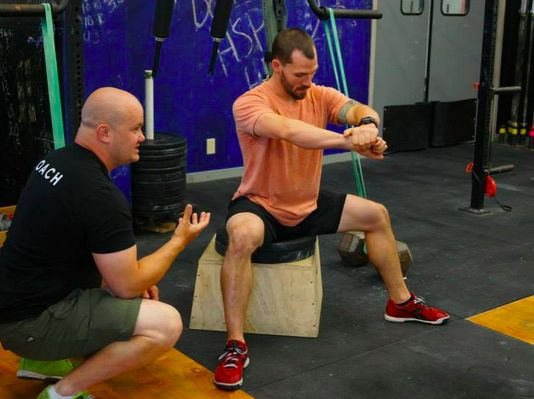

## 颈椎病

### 枕头

买个好点的乳胶枕

枕头过低，容易导致肩部和颈部酸痛。枕头过高，则使得颈椎不能保持正常弧度，从而加重颈椎负担，导致颈椎疼痛。除了要选择高低适中的枕头之外，软硬也是一个重要因素。选择软硬程度合适的枕头，才能更好地与颈部和头部弧线契合，支撑头部和颈部重力

### 颈部操

[b站视频](https://b23.tv/av15360432)

[知乎一个医生的回答](https://www.zhihu.com/question/265484812)

## 腰椎病

> 容易患的病：腰肌劳损或者腰间盘突出

长期光照不足，会导致维生素D缺失，缺钙

### 运动部分

[jeff关于腰的部分](https://b23.tv/av25019518/p1)

### 不要穿牛仔裤

因为牛仔裤的布料基本没弹性，你坐下的时候髋关节一弯，裤子前面就压得你难受，屁股后面么……

坐下时牛仔裤会给骨盆一个很强大的后倾力量，让你的屁股很难贴到靠背

### 一种可行的坐姿

这个坐姿脱胎于箱式深蹲，俗称蹲马步。相比一般并腿的坐姿，它是一个三点支撑，坐得更稳。而且大腿和臀不会有任何难受，腰背自然挺直。

## 久坐对前列腺的危害以及肥胖问题

## 眼疲劳、用眼过度、干眼症

### 眼药水

## 鼠标手

## 键盘腕

## 肩周炎

## 足底筋膜炎